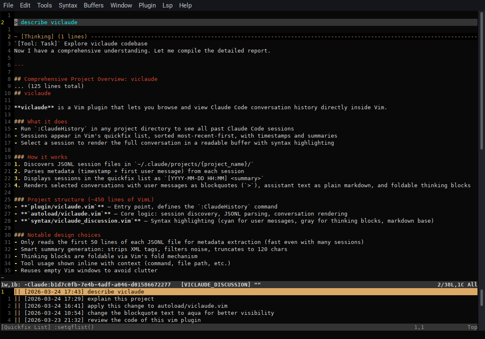

# viclaude

A Vim plugin for browsing Claude Code conversation history.

## Usage

Open Vim in a project directory where you've used Claude Code, then run:

```vim
:ClaudeHistory
```

This opens a quickfix list of sessions for the current project, sorted by most recent. Press `<Enter>` on an entry to view the rendered conversation.

To search across all sessions for a pattern:

```vim
:ClaudeGrep <pattern>
```

This opens a quickfix list of matching excerpts (one per match) from user and assistant messages, sorted by most recent session. Press `<Enter>` on an entry to open the rendered conversation jumped to that match.

To browse Claude Code memories saved for the current project:

```vim
:ClaudeMemory
```

This opens a quickfix list of memory entries (type, name, description) plus the `MEMORY.md` index. Press `<Enter>` on an entry to open the memory file for reading or editing.



## Install

With a plugin manager (e.g. vim-plug):

```vim
Plug 'Serpent7776/viclaude'
```

Or clone into your Vim packages directory:

```sh
git clone https://github.com/Serpent7776/viclaude ~/.vim/pack/plugins/start/viclaude
```

## License

MIT
